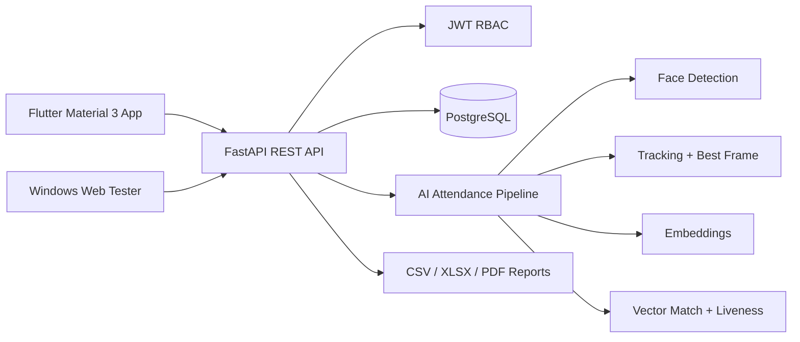

# AutoAttendance

Production-ready foundation for an AI-powered college attendance system. The platform is organized as a mobile-first Flutter application, a FastAPI backend, PostgreSQL persistence, a Windows-friendly browser tester, and an AI face-recognition pipeline built around embeddings and video processing.

## Architecture



## Repository Structure

- `backend/` FastAPI service, domain models, API routes, services, tests.
- `frontend/` Flutter Material 3 application skeleton using clean feature folders.
- `web-test-app/` static browser app for Windows testing with video upload/camera recording.
- `docs/` architecture, deployment, API, and database documentation.
- `docker-compose.yml` local PostgreSQL + API stack.

## Prerequisites

Install these tools before starting:

| Tool | Required for | Recommended version |
| --- | --- | --- |
| Git | Clone and manage the repository | Latest |
| Docker Desktop | Easiest backend + PostgreSQL startup | Latest stable |
| Python | Local backend tests and Windows web server | 3.12+ |
| Flutter SDK | Flutter mobile app development | 3.22+ |
| Chrome or Microsoft Edge | Windows web tester | Latest |

## Step-by-Step Installation With Docker

This is the recommended path for Windows because Docker starts PostgreSQL and the API together.

### 1. Clone the repository

```powershell
git clone <your-repository-url> AutoAttendance
cd AutoAttendance
```

### 2. Create the backend environment file

```powershell
copy backend\.env.example backend\.env
```

On macOS/Linux, use:

```bash
cp backend/.env.example backend/.env
```

### 3. Start PostgreSQL and FastAPI

```powershell
docker compose up --build
```

The API should be available at:

```text
http://localhost:8000
```

### 4. Verify the API health endpoint

Open this URL in your browser:

```text
http://localhost:8000/health
```

Or run:

```powershell
curl http://localhost:8000/health
```

Expected response:

```json
{"status":"ok"}
```

### 5. Stop the Docker stack

```powershell
docker compose down
```

To remove the local database volume as well:

```powershell
docker compose down -v
```

## Step-by-Step Backend Setup Without Docker

Use this path when you want to run FastAPI directly from your machine.

### 1. Enter the backend folder

```powershell
cd backend
```

### 2. Create and activate a virtual environment

Windows PowerShell:

```powershell
py -3.12 -m venv .venv
.\.venv\Scripts\Activate.ps1
```

macOS/Linux:

```bash
python3.12 -m venv .venv
source .venv/bin/activate
```

### 3. Install Python dependencies

```powershell
python -m pip install --upgrade pip
pip install -r requirements.txt
```

### 4. Configure environment variables

Windows PowerShell:

```powershell
copy .env.example .env
```

macOS/Linux:

```bash
cp .env.example .env
```

If you run without PostgreSQL, update `DATABASE_URL` in `.env` to a reachable database connection before using database-backed features.

### 5. Run the FastAPI development server

```powershell
uvicorn app.main:app --reload --host 0.0.0.0 --port 8000
```

API docs will be available at:

```text
http://localhost:8000/docs
```

### 6. Run backend tests

```powershell
pytest
```

## Step-by-Step Windows Web Tester Setup

The web tester lets you test from a Windows browser without installing Flutter.

### 1. Start the backend

Use either Docker or the local backend setup above. Confirm this works first:

```powershell
curl http://localhost:8000/health
```

### 2. Start the static web server

Open a second PowerShell window from the repository root and run:

```powershell
cd web-test-app
py -m http.server 8080
```

### 3. Open the tester

Open Chrome or Microsoft Edge at:

```text
http://localhost:8080
```

### 4. Submit a test video

1. Confirm the API status pill says `API online`.
2. Enter department, year, section, and subject.
3. Upload a classroom video, or click **Start Camera** and **Record 10s**.
4. Click **Send Preview**.
5. Review Present, Absent, Unknown/Rejected, and raw JSON output.

Camera recording works on `localhost` in modern browsers. If you deploy the tester to another host, use HTTPS for camera permission.

## Step-by-Step Flutter App Setup

### 1. Verify Flutter installation

```powershell
flutter doctor
```

Resolve any Android Studio, Xcode, or browser issues reported by `flutter doctor`.

### 2. Install Flutter dependencies

```powershell
cd frontend
flutter pub get
```

### 3. Run the Flutter app for web testing

```powershell
flutter run -d chrome
```

### 4. Run the Flutter app on an Android device or emulator

```powershell
flutter devices
flutter run
```

## Common Development Commands

From the repository root:

```powershell
# Start all containerized services
docker compose up --build

# Stop services
docker compose down

# Run backend syntax compilation
python -m compileall backend/app

# Run backend tests after installing dependencies
cd backend
pytest

# Start Windows web tester
cd web-test-app
py -m http.server 8080
```


## Other Testing Options

You do not have to use the Windows web tester. Additional options are documented in `docs/TESTING.md`, including:

- FastAPI Swagger UI at `http://localhost:8000/docs`.
- PowerShell `Invoke-RestMethod` requests with video upload.
- `curl` multipart requests.
- Postman or Insomnia form-data requests.
- Automated `pytest` backend tests.
- Docker smoke tests and logs.
- Flutter web/mobile testing commands.

## Troubleshooting

- **Docker says the port is already in use:** stop the existing service or change the mapped port in `docker-compose.yml`.
- **Browser tester says API offline:** confirm the backend is running and that `API Base URL` is `http://localhost:8000`.
- **Camera does not open:** use Chrome/Edge on `http://localhost:8080`; browser camera APIs require localhost or HTTPS.
- **`pip install` fails:** check your internet/proxy settings and retry in a fresh virtual environment.
- **PostgreSQL connection fails:** verify `DATABASE_URL` in `backend/.env` and make sure the database container is healthy.

- `docs/` architecture, deployment, API, and database documentation.
- `docker-compose.yml` local PostgreSQL + API stack.

## Quick Start

```bash
cp backend/.env.example backend/.env
docker compose up --build
```

Run backend tests locally:

```bash
cd backend
python -m venv .venv
source .venv/bin/activate
pip install -r requirements.txt
pytest
```

## Security Baseline

- Passwords are hashed with Argon2 via Passlib.
- JWT access tokens include user role claims.
- Role-based access control is enforced per route.
- SQLAlchemy parameterized queries prevent SQL injection.
- Audit log model records security-sensitive actions.
- Face embeddings are stored separately from registration media and exposed only through privileged services.

## AI Attendance Flow

1. Teacher selects department, year, section, and subject.
2. Teacher records a 5-10 second panoramic classroom video.
3. Backend extracts frames, detects faces, tracks repeated faces, selects the clearest face crop, checks liveness signals, generates embeddings, and matches against enrolled students.
4. Duplicate identities are collapsed into one attendance candidate.
5. Teacher reviews present, absent, unknown faces, and confidence scores before saving.

## Production Notes

This repository provides the deployable architecture and integration points. For production, configure cloud object storage, GPU-backed AI workers, managed PostgreSQL backups, HTTPS ingress, secrets management, and monitoring.
