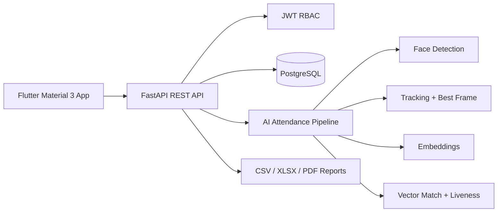

# AutoAttendance

Production-ready foundation for an AI-powered college attendance system. The platform is organized as a mobile-first Flutter application, a FastAPI backend, PostgreSQL persistence, and an AI face-recognition pipeline built around embeddings and video processing.

## Architecture



## Repository Structure

- `backend/` FastAPI service, domain models, API routes, services, tests.
- `frontend/` Flutter Material 3 application skeleton using clean feature folders.
- `docs/` architecture, deployment, API, and database documentation.
- `docker-compose.yml` local PostgreSQL + API stack.

## Quick Start

```bash
cp backend/.env.example backend/.env
docker compose up --build
```

Run backend tests locally:

```bash
cd backend
python -m venv .venv
source .venv/bin/activate
pip install -r requirements.txt
pytest
```

## Security Baseline

- Passwords are hashed with Argon2 via Passlib.
- JWT access tokens include user role claims.
- Role-based access control is enforced per route.
- SQLAlchemy parameterized queries prevent SQL injection.
- Audit log model records security-sensitive actions.
- Face embeddings are stored separately from registration media and exposed only through privileged services.

## AI Attendance Flow

1. Teacher selects department, year, section, and subject.
2. Teacher records a 5-10 second panoramic classroom video.
3. Backend extracts frames, detects faces, tracks repeated faces, selects the clearest face crop, checks liveness signals, generates embeddings, and matches against enrolled students.
4. Duplicate identities are collapsed into one attendance candidate.
5. Teacher reviews present, absent, unknown faces, and confidence scores before saving.

## Production Notes

This repository provides the deployable architecture and integration points. For production, configure cloud object storage, GPU-backed AI workers, managed PostgreSQL backups, HTTPS ingress, secrets management, and monitoring.
